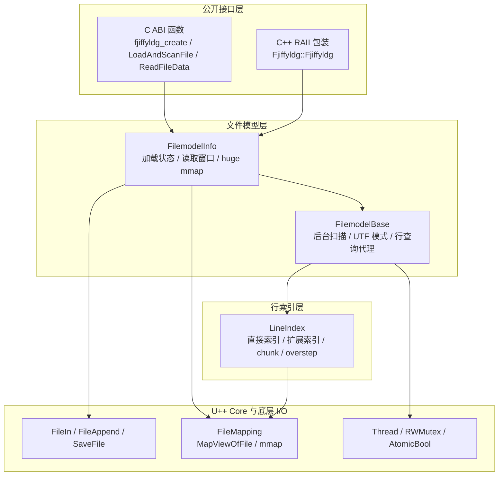
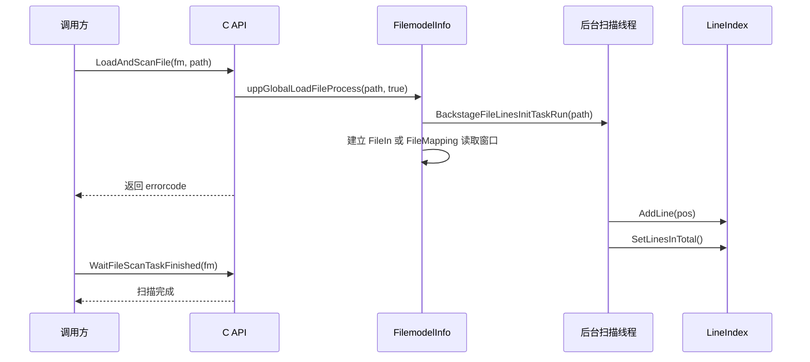

# C++ 版本总体设计

[English](cpp_design_en.md)

本文基于 `reference/fjiffyldg/Fjiffyldg/` 下的 C++ 参考实现逐块审阅整理，目标是记录原始版本的总体设计思路、模块划分、接口约定、线程/内存/错误策略、互操作性注意事项与高层架构。它既可作为 Rust 版本对齐行为的参照，也可作为后续维护 C/C++ ABI 与大文件处理逻辑时的设计索引。

## 1. 设计目标

C++ 版本的核心目标是为超大文本文件提供低内存占用的随机访问能力：文件内容不强制完整读入内存，而是通过流式窗口或内存映射窗口按需读取；行结构扫描在后台执行，并用分级索引降低海量行号带来的内存膨胀；公开层同时提供 C ABI 与 C++ RAII 包装，便于被 C、C++ 或其他语言 FFI 调用。

关键设计取向如下：

- 文件内容位置和行号均使用从 `0` 开始的索引。
- 文件偏移、行号和文件大小使用 `long long` / `int64` 表示，理论上面向极大文件；单次读取长度使用 `unsigned int` / `uint32`。
- 小文件与大文件走不同 I/O 路径：小文件使用 `FileIn` 流窗口，大文件使用 `FileMapping` 映射窗口。
- 行扫描与数据读取分离：`LoadAndScanFile` 会加载可读窗口并启动后台行扫描；`LoadFileOnly` 只建立读取窗口，不构建行结构。
- 返回给调用方的数据指针均为库内部拥有的借用指针，调用方不得释放，也不得跨重映射、清理或销毁继续使用。

## 2. 高层架构图



## 3. 模块划分

### 3.1 公开 API 层

公开头文件位于 [`reference/fjiffyldg/Fjiffyldg/src/fjiffyldg.h`](../../reference/fjiffyldg/Fjiffyldg/src/fjiffyldg.h)，发布头位于 [`reference/fjiffyldg/Fjiffyldg/include/fjiffyldg.h`](../../reference/fjiffyldg/Fjiffyldg/include/fjiffyldg.h)，两者承担同一组 ABI 声明：

- `FJIFFYLDG_API` 根据是否构建动态库和目标平台选择 `dllexport`、`dllimport` 或 ELF visibility。
- `fjiffyldg_ptr` 是不透明句柄，C 调用方只能通过函数操作它。
- C 编译模式暴露 `fjiffyldg_create()` 与 `fjiffyldg_clear()`；C++ 编译模式隐藏这两个动态内存函数，改由 `Fjiffyldg::Fjiffyldg` RAII 类型托管生命周期。
- C++ 包装类使用 PIMPL 与 `std::unique_ptr`，拷贝被禁用，移动被允许，`GetFjiffyldgHandle()` 返回内部 `FilemodelInfo` 的借用句柄。

实现位于 [`reference/fjiffyldg/Fjiffyldg/src/fjiffyldg.cpp`](../../reference/fjiffyldg/Fjiffyldg/src/fjiffyldg.cpp)。该文件主要是薄封装：把 `fjiffyldg_ptr` `static_cast` 为 `FilemodelInfo*`，然后转发给文件模型层。例外是 ASCII/UTF-8 检测、快速拷贝和 clone/save/append/concat 这类无句柄工具函数，它们也在该文件中实现。

### 3.2 文件模型层

文件模型定义在 [`reference/fjiffyldg/Fjiffyldg/src/uppFilemodel.h`](../../reference/fjiffyldg/Fjiffyldg/src/uppFilemodel.h)，实现位于 [`reference/fjiffyldg/Fjiffyldg/src/uppFilemodel.cpp`](../../reference/fjiffyldg/Fjiffyldg/src/uppFilemodel.cpp)。它分为两层：

- `FilemodelBase` 管理后台扫描线程、UTF 模式、行索引对象和行查询代理。
- `FilemodelInfo` 继承 `FilemodelBase`，管理加载错误码、文件大小、小文件流窗口、大文件 mmap 窗口，以及 `GetFileMappedHuge` 使用的独立整文件映射。

`FilemodelInfo` 的主要状态包括：

- `errorcode`：最近一次加载错误码。
- `content`：小文件路径下当前 `FileIn` 流窗口缓存。
- `fin`：小文件流式读取句柄。
- `fmap`：大文件读取窗口映射。
- `huger`：整文件映射接口使用的独立映射。
- `fsize`：已加载文件大小，`-1` 表示未加载。

### 3.3 行索引层

行索引定义在 [`reference/fjiffyldg/Fjiffyldg/src/FileLineIndex.h`](../../reference/fjiffyldg/Fjiffyldg/src/FileLineIndex.h)，模板辅助位于 [`reference/fjiffyldg/Fjiffyldg/src/FileLineIndex.hpp`](../../reference/fjiffyldg/Fjiffyldg/src/FileLineIndex.hpp)，算法实现位于 [`reference/fjiffyldg/Fjiffyldg/src/FileLineIndex.cpp`](../../reference/fjiffyldg/Fjiffyldg/src/FileLineIndex.cpp)。

`LineIndex` 的设计重点是避免为超大文件的每一行都长期保存 64 位偏移。它把行位置索引分为四类：

| 结构                       | 作用                                  | 触发条件                                                                |
| -------------------------- | ------------------------------------- | ----------------------------------------------------------------------- |
| `direct: Vector<uint32>`   | 保存常规文件中前若干行的 32 位偏移    | 行偏移可放入 `uint32`，且总精确索引数未超过 `DIRECT_LINES_MAX`          |
| `exdirect: Vector<int64>`  | 保存前若干行中超过 4GB 的 64 位偏移   | 总精确索引数未超过 `DIRECT_LINES_MAX`，但偏移超过 `UINT_MAX`            |
| `chunk: Vector<LindexPos>` | 保存百万行之后的稀疏分区索引          | 精确索引超过 `DIRECT_LINES_MAX` 后，每个约 `128KB` 文件跨度记录一个分区 |
| `overstep`                 | 记录超过 chunk 管理上限后的第一个位置 | `chunk` 数量达到 `CHUNK_COUNT_MAX`                                      |

核心常量：

- `DIRECT_LINES_MAX = 1_000_000`：前 100 万行保存精确偏移。
- `CHUNK_BEGIN = DIRECT_LINES_MAX + 1`：chunk 索引覆盖的起始行号。
- `CHUNK_SIZE = 128 * KB`：每个 chunk 约对应 128KB 文件跨度。
- `CHUNK_COUNT_MAX = 8 * MB`：最多约 838 万个 chunk，按注释约覆盖 1TB 的 chunk 管理范围。

### 3.4 底层 I/O 与 U++ Core 依赖

底层映射封装来自 U++ Core 的 [`reference/fjiffyldg/Fjiffyldg/src/Core/FileMapping.h`](../../reference/fjiffyldg/Fjiffyldg/src/Core/FileMapping.h) 与 [`reference/fjiffyldg/Fjiffyldg/src/Core/FileMapping.cpp`](../../reference/fjiffyldg/Fjiffyldg/src/Core/FileMapping.cpp)。它在 Windows 上使用 `CreateFileMapping` / `MapViewOfFile`，在 POSIX 上使用 `mmap` / `munmap`，并统一提供：

- `Open()` / `Create()`：打开或创建文件映射对象。
- `Map(offset, len)`：映射指定窗口。
- `Unmap()` / `Close()`：释放当前视图和底层句柄。
- `GetOffset()` / `GetCount()`：描述当前已映射窗口的逻辑偏移与长度。

`Map()` 每次都会先 `Unmap()` 旧视图，再按系统映射粒度向下对齐 raw offset，最后把 `base` 调整到调用方请求的逻辑偏移。这一点决定了所有读取接口返回的指针只能短期使用。

## 4. 文件加载与读取流程

### 4.1 加载主流程

公开入口：

- `LoadAndScanFile(fm, name)`：调用 `FilemodelInfo::uppGlobalLoadFileProcess(name, true)`，并返回 `GetErrorcode()`。
- `LoadFileOnly(fm, name)`：调用 `FilemodelInfo::uppGlobalLoadFileProcess(name, false)`，并返回 `GetErrorcode()`。

`uppGlobalLoadFileProcess` 的流程如下：

1. 清空 `errorcode`，把 `fsize` 置为 `-1`。
2. 检查文件是否存在；不存在则设置 `errorcode = -1`。
3. 读取文件大小；失败则设置 `errorcode = 1`。
4. 如果启用扫描，先请求旧扫描停止并清空旧索引，再启动后台扫描线程。
5. 文件大小 `<= 10MB` 时使用 `FileIn` 打开，并读取一个 `FILEBLOCK = 1MB` 的流窗口到 `content`。
6. 文件大小 `> 10MB` 时使用 `FileMapping` 打开；小于 1GB 映射全文件，否则只映射起始的 `1GB` 窗口。
7. 成功后记录 `fsize = size`。

注意：小文件路径也不是“完整文件常驻内存”语义。初次加载最多读取 1MB，后续随机读取如果越过当前窗口，会通过 `ReloadData` 重新定位流窗口。

### 4.2 读取窗口策略

`ReadFileData(fm, pos, len)` 会把 `len == 0` 解释为默认读取 `128KB`，再调用 `FilemodelInfo::ReadData(pos, length)`。`ReadData` 的语义是：

- 未加载时返回 `NULL`，并把长度改为 `0`。
- `pos` 被裁剪到 `[0, fsize]`。
- 如果 `pos` 不在当前窗口 `[GetDataPos(), GetDataPos() + GetDataLength())` 内，调用 `ReloadData(pos)`。
- 返回当前窗口内 `pos` 对应位置的指针，并把 `len` 裁剪到当前窗口剩余长度。

`ReloadData` 在大文件路径下按 `MMAP_FILECHUNK = 1GB` 对齐重映射；在小文件路径下按 `FILEBLOCK = 1MB` 对齐移动 `FileIn` 读取窗口。

### 4.3 按行读取

`ReadFileDataLLineCut` 与 `ReadFileDataEndOfLine` 建立在行索引之上：

- `ReadFileDataLLineCut` 从指定行开始，尽量按完整行批量读取，同时将单行跨度限制在 `CRITICAL_LONGLINE_LEN = 4KB` 附近，避免超长行导致一次读取过大。它通过 `index` 返回推进后的行号，通过 `bpos` / `epos` 返回理想读取范围，通过 `len` 返回实际读取字节数。
- `ReadFileDataEndOfLine` 从某行内指定字节位置读取到该行尾或指定长度上限，默认长度也是 4KB。它要求传入的 `index` 能包含 `pos`，否则返回 `NULL` 并把 `len` 置为 `0`。

这两个接口依赖后台扫描已完成或至少相关行位置可查询。调用方需要稳定行信息时应先调用 `WaitFileScanTaskFinished`。

### 4.4 整文件映射

`GetFileMappedHuge(fm, fileName, bufferSize)` 使用 `FilemodelInfo::huger` 独立打开并尝试一次性映射整个文件，成功时返回映射指针并写出大小。`ClearHugeBuffer(fm)` 关闭该映射。

该接口适合调用方确实需要整文件连续视图的场景，但它受进程地址空间、`size_t`、OS 映射限制和文件大小影响。失败时返回 `NULL`，并把大小置为 `0`。

## 5. 行扫描与行索引算法

### 5.1 后台扫描流程

`LoadAndScanFile` 或 `RestartScanFile` 会通过 `BackstageFileLinesInitTaskRun` 启动 U++ `Thread`。线程体调用 `BackstageFileLinesInitTask(path, offset, utfverifiable)`：

1. 打开 `LineIndex` 内部持有的 `FileMapping`。
2. 从指定 `offset` 开始映射 `SCAN_FILE_CHUNK = 10MB`。
3. 当未显式指定 UTF 模式时，根据文件头 BOM 识别 UTF-32LE、UTF-32BE、UTF-16LE、UTF-16BE。
4. 调用 `ScanLineStats` 按窗口扫描换行。
5. 每扫完一个窗口，如果扫描仍未被取消，则把窗口推进到下一个位置。
6. 正常完成时调用 `linestats.SetLinesInTotal()` 固化总行数，并把 `linescanRunning` 置为 `false`。

`linescanRunning` 是 `std::atomic<bool>`。扫描循环会在窗口之间检查它；`BackstageRequestStop` 把它设为 `false`，再等待线程退出并清空索引。

### 5.2 换行识别

换行处理由 `FileLineIndex.hpp` 中的模板函数完成。设计上统一支持窄字节、UTF-16 与 UTF-32：

- 默认模式按单字节扫描 `\n` 与 `\r`。
- UTF-16LE / UTF-32LE 在宽字符的第一个字节位置比较 `\n` / `\r`。
- UTF-16BE 在宽字符的第 2 个字节位置比较。
- UTF-32BE 在宽字符的第 4 个字节位置比较。
- `IsReadNewlineChar` 把 `LF` 和 `CRLF` 都视为换行；遇到 `CRLF` 会跳过 `LF`。
- `GetNewlineByteCount` 用于行长度计算，按 UTF 宽度从行尾扣除 `LF` 或 `CRLF` 的字节数。

跨扫描窗口时，`UpdateLineStats` 用 `last` 记录前一窗口末尾是否是 `CR`。如果下一窗口开头不是 `LF`，会把上一窗口末尾 `CR` 当作独立换行处理。

### 5.3 行位置查询

`GetLindexPos(i, utfmode)` 负责按行号返回字节偏移：

- `i < 0` 返回 `-1`；`i == 0` 返回 `0`。
- 如果命中 `lastline / lastpos`，直接返回缓存。
- 如果在 `direct` 或 `exdirect` 范围内，直接返回保存的精确偏移。
- 如果超过精确索引范围，则通过 `chunk` 二分找到目标行所在分区。
- 找到分区起点后，根据扫描是否已完成决定映射策略：扫描完成后可重新 `Map(pos, CHUNK_SIZE)`；扫描进行中只能在当前扫描窗口内借用已有映射。
- 从分区起点按 UTF 模式重新扫描到目标行，并更新 `lastline / lastpos`。

因此，前 100 万行查询近似 O(1)；百万行之后先按 chunk 二分，再在 128KB 左右窗口内线性扫描。连续递增访问会利用 `lastline / lastpos` 减少重复扫描。

### 5.4 行长度与反查行号

`GetLineLen(i, utfmode)` 要求扫描已完成，且 `i` 在总行数范围内。它先获取当前行起点，再获取下一行起点；如果是最后一行，则长度为 `file_size - pos`。非最后一行会映射行内容并扣除换行符字节数。

`GetLineByPos(pos, utfmode)` 负责按字节偏移反查行号：

- 扫描未完成、`pos < 0` 或 `pos > file_size` 时返回 `-1`。
- 先在 `direct` / `exdirect` 中按位置二分。
- 如果进入 chunk 区域，再按 chunk 起始位置二分找到可能分区。
- 对 chunk 区域使用 `GetLindexPos(index + 1)` 逐步推进，直到定位 `pos` 所在行。

## 6. 编码策略

C++ 版本公开了两类编码能力：行扫描时的 UTF 模式处理，以及独立的 ASCII/UTF-8 检测工具函数。

### 6.1 UTF 模式

`RestartScanFile(fm, name, offset, utf)` 中的 `utf` 含义如下：

| 值   | 含义                       |
| ---- | -------------------------- |
| `0`  | 默认模式，按单字节换行扫描 |
| `1`  | UTF-16LE                   |
| `2`  | UTF-16BE                   |
| `3`  | UTF-32LE                   |
| `4`  | UTF-32BE                   |
| `-1` | 启用自动检测               |
| 其他 | 回退默认模式               |

实现细节上，`SetUtfMode` 只接受 `0..=4`，其他值会回退为 `0`。随后 `BackstageFileLinesReScan(name, offset, utf != -1)` 会用 `utfverifiable` 控制是否跳过 BOM 自动检测：当 `utf == -1` 时允许根据 BOM 自动检测；当调用方显式传入 `1..4` 时不再自动覆盖。

### 6.2 BOM 检测

后台扫描在默认/自动检测路径下检查文件前 4 字节：

- `0x0000FEFF` 识别为 UTF-32LE。
- `0xFFFE0000` 识别为 UTF-32BE。
- `0xFEFF` 识别为 UTF-16LE。
- `0xFFFE` 识别为 UTF-16BE。

这里的检测服务于换行宽度识别，并不把文件内容转换成 UTF-8。U++ Core 里另有 `LoadStreamBOM` / `LoadFileBOM` 这类文本转换工具，但 fjiffyldg 的核心读取接口返回原始字节视图。

### 6.3 ASCII 与 UTF-8 工具函数

无句柄工具函数位于 `fjiffyldg.cpp`：

- `CheckTextASCII(text, len)`：检查是否全 ASCII。`0` 表示全 ASCII，否则返回从首个非 ASCII 字节到末尾的剩余长度。长度不小于 8 时用 64 位掩码 `0x8080808080808080` 加速。
- `CheckWholeTextUtf8(text, len)`：完整 UTF-8 校验。`0` 表示有效，否则返回从首个无效字符到末尾的剩余长度。
- `CheckExtractTextUtf8(text, len)`：面向截断片段的 UTF-8 检测，先处理片段首尾可能落在多字节字符中间的情况，再复用完整检测。
- `GetUtf8TextCharCount(&text, len)`：统计有效 UTF-8 字符数，并把调用方传入的指针推进到停止位置。

这些函数只检查 UTF-8 字节结构，不执行 Unicode 规范层面的全部语义校验，例如不主动拒绝所有过长编码或非法码点组合。

## 7. 线程策略

### 7.1 后台扫描线程

行扫描使用 U++ `Thread`。`BackstageFileLinesInitTaskRun` 调用 `lnscan.Run(...)`，成功后把 `linescanRunning` 置为 `true`。线程完成时，如果仍处于运行状态，会固化总行数并把运行标志置回 `false`。

对外可见状态：

- `GetFileLineCount()` 在 `linescanRunning == true` 时返回 `-1`，表示扫描中。
- 未开始扫描且没有完整索引时返回 `0`。
- 扫描完成后返回正数行数。

### 7.2 停止与等待

- `WaitFileScanTaskFinished(fm)` 直接调用 `lnscan.Wait()`，阻塞直到后台线程结束。
- `BackstageRequestStop(false)` 把 `linescanRunning` 设为 `false`，等待线程退出，然后清空索引。
- `BackstageRequestStop(true)` 用在析构路径，快速设置停止标记并返回，随后 `FilemodelInfo::~FilemodelInfo` 调用 `lnscan.ShutdownThreads()`。
- `BackstageFileLinesReScan` 会先停止旧扫描，再启动新扫描。

### 7.3 锁与共享映射

`LineIndex` 使用两个 `RWMutex`：

- `veclock` 保护 `direct`、`exdirect`、`chunk`、`overstep` 等索引容器。
- `maplock` 保护扫描映射窗口。扫描推进窗口时用写锁，查询借用当前扫描窗口或重新映射时用读锁。

扫描未完成时，`GetLindexPos` 只允许查询当前已映射扫描窗口能覆盖的 chunk；扫描完成后可以按需重新映射目标 chunk。这个策略减少了扫描中查询与扫描线程之间的映射视图冲突。

## 8. 内存策略

### 8.1 借用指针与失效条件

所有返回 `const char*` 的接口都返回库内部内存：

- `ReadFileData` / `ReadFileDataLLineCut` / `ReadFileDataEndOfLine` 返回 `content` 或 `fmap` 当前窗口内部指针。
- `GetFileMappedHuge` 返回 `huger` 的当前整文件映射指针。

调用方不能 `free`、`delete` 或写入这些指针。以下操作会让旧指针失效：

- 同一句柄再次读取且触发 `ReloadData`。
- 同一 `FileMapping` 再次 `Map`，因为它会先 `Unmap` 旧视图。
- 调用 `ClearHugeBuffer`。
- 调用 `LoadAndScanFile` / `LoadFileOnly` 重新加载其他文件。
- 调用 `fjiffyldg_clear` 或 C++ RAII 对象析构。

### 8.2 大文件 I/O

大文件读取、克隆和保存都尽量避免一次性分配同等大小内存：

- 常规读取：`FilemodelInfo::fmap` 维护最大 1GB 的当前读取窗口。
- 后台扫描：`LineIndex` 内部映射按 10MB 扫描窗口推进。
- `ToCloneFile`：大于 10MB 时用两个 `FileMapping`，按 1GB 分块从源映射复制到目标映射。
- `ToSaveFile`：大于 10MB 时创建目标映射并按 1GB 分块写入。
- `ToAppendFile`：使用 `FileAppend`，按输入大小选择 4MB、16MB 或 64MB 追加块。
- `ToConcatenateFile`：把源文件按 64 位平台 4GB、其他平台 1GB 的窗口映射后同步追加到目标文件。

审阅时发现一个值得记录的风险：`FileSaveByFileMapping` 的分块保存循环推进了 `offset`，但传给 `CopyDataByFileMapping` 的 `buffer` 没有同步前移。因此当 `len >= 1GB` 时，后续块存在重复从缓冲起点复制的风险。Rust 版本若复刻行为应避免继承该缺陷；C++ 版本维护时也应优先修正。

## 9. 错误策略

文件加载类错误码在头文件中定义为：

| 错误码 | 含义                   |
| ------ | ---------------------- |
| `0`    | 成功                   |
| `-1`   | 文件不存在，或尚未加载 |
| `1`    | 文件内容或属性不可访问 |
| `2`    | 文件流错误             |
| `3`    | 内存映射错误           |

调用约定并不完全统一，但总体规律如下：

- 加载函数返回上述错误码。
- `GetFileIsLoaded` 先返回 `errorcode`；如果没有错误但 `fsize < 0`，返回 `-1`。
- 行查询函数返回非负值表示成功，负数表示未扫描、扫描中不可得或非法位置。
- 读数据函数成功返回指针，失败返回 `NULL`，并通常把输出长度置为 `0`。
- ASCII/UTF-8 检测函数以 `0` 表示完全满足条件，非零表示剩余未通过长度。
- 文件写入/复制类函数以 `0` 表示成功，`1` 表示结果文件大小不符合预期，负数表示更严重错误。

实现层对空指针和非法 ABI 调用几乎没有防御。例如 `ReadFileData` 直接解引用 `len`，多数函数直接把 `fm` 转成 `FilemodelInfo*` 使用。跨语言绑定必须在外层保证句柄、路径、输出指针和长度指针均有效。

## 10. 互操作性注意事项

### 10.1 C ABI

C 调用方应遵循：

```c
fjiffyldg_ptr fm = fjiffyldg_create();
int rc = LoadAndScanFile(fm, "input.txt");
if (rc == 0) {
    WaitFileScanTaskFinished(fm);
    unsigned int len = 0;
    const char *data = ReadFileData(fm, 0, &len);
    /* data 是借用指针，不要 free。 */
}
fjiffyldg_clear(fm);
```

重点约定：

- `fjiffyldg_create` 与 `fjiffyldg_clear` 必须配对。
- `unsigned int* len`、`long long* bpos`、`long long* epos`、`long long* bufferSize` 必须传入真实匹配类型的可写地址。
- 文件名参数是 `const char*`，实现直接交给 U++ 文件接口；跨平台路径编码需要调用方统一约定，尤其是 Windows 上的非 ASCII 路径。
- 不能保存返回指针并在后续重映射或销毁后继续使用。

### 10.2 C++ RAII

C++ 调用方应使用：

```cpp
Fjiffyldg::Fjiffyldg model;
fjiffyldg_ptr handle = model.GetFjiffyldgHandle();
LoadAndScanFile(handle, "input.txt");
WaitFileScanTaskFinished(handle);
```

`GetFjiffyldgHandle()` 返回的是 RAII 对象内部资源的借用句柄，不应传给 `fjiffyldg_clear()`。该句柄不能超过 `Fjiffyldg::Fjiffyldg` 对象生命周期。

### 10.3 与 Rust/C API 对齐

Rust 版本对齐 C++ 行为时，建议把 C++ 的设计约定与实现缺陷分开处理：

- 应保留的行为：零基行号/偏移、C ABI 不透明句柄、默认 128KB 读取、4KB 长行截断、UTF-16/32 换行宽度、后台扫描可等待、读指针短生命周期语义。
- 可改进的实现：空指针防御、线程完成通知、错误类型表达、mmap 写入分块时源缓冲推进、路径编码文档、返回指针生命周期说明。

## 11. 关键流程图

### 11.1 加载并扫描



### 11.2 随机读取

```mermaid
flowchart LR
    A[ReadFileData(pos, len)] --> B{文件已加载?}
    B -- 否 --> C[返回 NULL, len=0]
    B -- 是 --> D[裁剪 pos 到文件范围]
    D --> E{pos 在当前窗口?}
    E -- 否 --> F[ReloadData\n小文件 1MB 流窗口\n大文件 1GB mmap 窗口]
    E -- 是 --> G[复用当前窗口]
    F --> H[裁剪 len 到窗口剩余]
    G --> H
    H --> I[返回内部借用指针]
```

## 12. 设计风险与维护建议

- **指针生命周期风险**：文档和 FFI 绑定必须持续强调返回指针是借用视图，下一次读取、重映射、清理或销毁都可能失效。
- **空指针风险**：C++ 原实现对空句柄和空输出指针没有防御，外层绑定应补充参数校验。
- **扫描状态竞态**：`BackstageFileLinesInitTaskRun` 在线程启动成功后才设置 `linescanRunning = true`，极短窗口内状态查询可能观察到尚未置位的状态。
- **超大保存风险**：`FileSaveByFileMapping` 对超过 1GB 的输入缓冲存在源指针未随 offset 推进的问题，维护 C++ 版本时应修复。
- **路径编码未显式定义**：`const char*` 文件名在跨平台和跨语言场景下需要调用方约定编码。
- **BOM 检测只服务行扫描**：核心读取接口返回原始字节，不做文本解码；调用方不能假设返回内容已转换为 UTF-8。
- **chunk 查询仍需局部回扫**：百万行之后的行号查询不是纯 O(1)，而是先定位 chunk 再在映射窗口中扫描。性能评估应覆盖超百万行和长行文件。

## 13. 源码索引

| 主题                             | 文件                                                                                                                                                                                                                                                                                                                                                   |
| -------------------------------- | ------------------------------------------------------------------------------------------------------------------------------------------------------------------------------------------------------------------------------------------------------------------------------------------------------------------------------------------------------ |
| 公开 C/C++ API                   | [`reference/fjiffyldg/Fjiffyldg/src/fjiffyldg.h`](../../reference/fjiffyldg/Fjiffyldg/src/fjiffyldg.h), [`reference/fjiffyldg/Fjiffyldg/include/fjiffyldg.h`](../../reference/fjiffyldg/Fjiffyldg/include/fjiffyldg.h)                                                                                                                                 |
| API 实现、编码检测、文件工具函数 | [`reference/fjiffyldg/Fjiffyldg/src/fjiffyldg.cpp`](../../reference/fjiffyldg/Fjiffyldg/src/fjiffyldg.cpp)                                                                                                                                                                                                                                             |
| 文件模型与后台扫描               | [`reference/fjiffyldg/Fjiffyldg/src/uppFilemodel.h`](../../reference/fjiffyldg/Fjiffyldg/src/uppFilemodel.h), [`reference/fjiffyldg/Fjiffyldg/src/uppFilemodel.cpp`](../../reference/fjiffyldg/Fjiffyldg/src/uppFilemodel.cpp)                                                                                                                         |
| 行索引结构与算法                 | [`reference/fjiffyldg/Fjiffyldg/src/FileLineIndex.h`](../../reference/fjiffyldg/Fjiffyldg/src/FileLineIndex.h), [`reference/fjiffyldg/Fjiffyldg/src/FileLineIndex.hpp`](../../reference/fjiffyldg/Fjiffyldg/src/FileLineIndex.hpp), [`reference/fjiffyldg/Fjiffyldg/src/FileLineIndex.cpp`](../../reference/fjiffyldg/Fjiffyldg/src/FileLineIndex.cpp) |
| mmap / MapViewOfFile 封装        | [`reference/fjiffyldg/Fjiffyldg/src/Core/FileMapping.h`](../../reference/fjiffyldg/Fjiffyldg/src/Core/FileMapping.h), [`reference/fjiffyldg/Fjiffyldg/src/Core/FileMapping.cpp`](../../reference/fjiffyldg/Fjiffyldg/src/Core/FileMapping.cpp)                                                                                                         |
| U++ UTF/BOM 辅助                 | [`reference/fjiffyldg/Fjiffyldg/src/Core/Utf.cpp`](../../reference/fjiffyldg/Fjiffyldg/src/Core/Utf.cpp), [`reference/fjiffyldg/Fjiffyldg/src/Core/Bom.cpp`](../../reference/fjiffyldg/Fjiffyldg/src/Core/Bom.cpp)                                                                                                                                     |
| C API 示例                       | [`reference/fjiffyldg/Fjiffyldg/example/test/test.c`](../../reference/fjiffyldg/Fjiffyldg/example/test/test.c)                                                                                                                                                                                                                                         |
