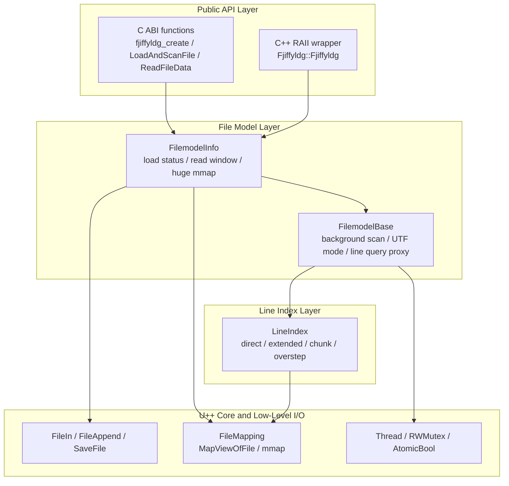
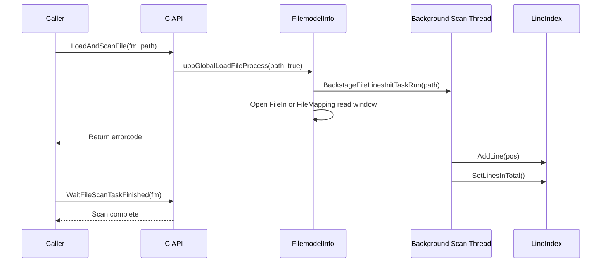

# C++ Architecture Design

[Chinese](cpp_design.md)

This document is based on a detailed review of the C++ reference implementation under `reference/fjiffyldg/Fjiffyldg/`. It records the original version's overall design ideas, module boundaries, interface contracts, threading, memory and error strategies, interoperability notes, and high-level architecture. It can be used both as a behavior reference for the Rust version and as a design index for future C/C++ ABI and large-file processing maintenance.

## 1. Design Goals

The core goal of the C++ version is to provide low-memory random access for very large text files. File contents are not forced into memory as a whole; instead, the implementation reads through streaming windows or memory-mapped windows on demand. Line structure scanning runs in the background, and hierarchical indexes reduce memory growth for massive line counts. The public layer provides both a C ABI and a C++ RAII wrapper, making the library usable from C, C++, and other languages through FFI.

Key design choices:

- File content positions and line numbers are both zero-based.
- File offsets, line numbers, and file sizes use `long long` / `int64`, targeting very large files in principle; single-read lengths use `unsigned int` / `uint32`.
- Small and large files use different I/O paths: small files use a `FileIn` streaming window, while large files use a `FileMapping` mapping window.
- Line scanning is separated from data reads: `LoadAndScanFile` opens a readable window and starts background line scanning; `LoadFileOnly` only opens a readable window and does not build line structure.
- Data pointers returned to callers are borrowed pointers owned by the library. Callers must not free them, and must not keep using them after remapping, cleanup, or destruction.

## 2. High-Level Architecture



## 3. Module Boundaries

### 3.1 Public API Layer

The public source header is [`reference/fjiffyldg/Fjiffyldg/src/fjiffyldg.h`](../../reference/fjiffyldg/Fjiffyldg/src/fjiffyldg.h), and the install/distribution header is [`reference/fjiffyldg/Fjiffyldg/include/fjiffyldg.h`](../../reference/fjiffyldg/Fjiffyldg/include/fjiffyldg.h). They declare the same ABI surface:

- `FJIFFYLDG_API` selects `dllexport`, `dllimport`, or ELF visibility depending on dynamic-library mode and target platform.
- `fjiffyldg_ptr` is an opaque handle. C callers can only operate on it through exported functions.
- C compilation exposes `fjiffyldg_create()` and `fjiffyldg_clear()`; C++ compilation hides these dynamic-memory functions and expects callers to use the `Fjiffyldg::Fjiffyldg` RAII type.
- The C++ wrapper uses PIMPL and `std::unique_ptr`. Copying is disabled, moving is allowed, and `GetFjiffyldgHandle()` returns a borrowed handle to the internal `FilemodelInfo`.

The implementation is in [`reference/fjiffyldg/Fjiffyldg/src/fjiffyldg.cpp`](../../reference/fjiffyldg/Fjiffyldg/src/fjiffyldg.cpp). Most exported functions are thin wrappers: they `static_cast` `fjiffyldg_ptr` to `FilemodelInfo*` and forward to the file model layer. The exceptions are handle-free utilities such as ASCII/UTF-8 checks, fast copying, and clone/save/append/concatenate operations, which are also implemented in this file.

### 3.2 File Model Layer

The file model is declared in [`reference/fjiffyldg/Fjiffyldg/src/uppFilemodel.h`](../../reference/fjiffyldg/Fjiffyldg/src/uppFilemodel.h) and implemented in [`reference/fjiffyldg/Fjiffyldg/src/uppFilemodel.cpp`](../../reference/fjiffyldg/Fjiffyldg/src/uppFilemodel.cpp). It has two layers:

- `FilemodelBase` manages the background scan thread, UTF mode, line index object, and line-query proxy methods.
- `FilemodelInfo` inherits from `FilemodelBase` and manages load error code, file size, small-file streaming window, large-file mmap window, and the independent full-file mapping used by `GetFileMappedHuge`.

Important `FilemodelInfo` state:

- `errorcode`: error code from the latest load operation.
- `content`: current `FileIn` streaming-window buffer for the small-file path.
- `fin`: small-file streaming input handle.
- `fmap`: large-file read-window mapping.
- `huger`: independent mapping used by the full-file mapping API.
- `fsize`: loaded file size; `-1` means no file is loaded.

### 3.3 Line Index Layer

The line index is declared in [`reference/fjiffyldg/Fjiffyldg/src/FileLineIndex.h`](../../reference/fjiffyldg/Fjiffyldg/src/FileLineIndex.h). Template helpers are in [`reference/fjiffyldg/Fjiffyldg/src/FileLineIndex.hpp`](../../reference/fjiffyldg/Fjiffyldg/src/FileLineIndex.hpp), and algorithms are implemented in [`reference/fjiffyldg/Fjiffyldg/src/FileLineIndex.cpp`](../../reference/fjiffyldg/Fjiffyldg/src/FileLineIndex.cpp).

The main purpose of `LineIndex` is to avoid keeping a 64-bit offset for every line in very large files. It divides line-position indexes into four categories:

| Structure | Role | Trigger |
| --- | --- | --- |
| `direct: Vector<uint32>` | Stores 32-bit offsets for the early lines of normal files | The offset fits in `uint32`, and the total exact-index count has not exceeded `DIRECT_LINES_MAX` |
| `exdirect: Vector<int64>` | Stores 64-bit offsets for early lines beyond 4GB | The total exact-index count has not exceeded `DIRECT_LINES_MAX`, but the offset is greater than `UINT_MAX` |
| `chunk: Vector<LindexPos>` | Stores sparse partition indexes after the first million lines | Exact indexes exceed `DIRECT_LINES_MAX`; roughly one partition is recorded per `128KB` file span |
| `overstep` | Records the first position beyond the chunk-management limit | The number of chunks reaches `CHUNK_COUNT_MAX` |

Core constants:

- `DIRECT_LINES_MAX = 1_000_000`: store exact offsets for the first one million lines.
- `CHUNK_BEGIN = DIRECT_LINES_MAX + 1`: first line number covered by the chunk index.
- `CHUNK_SIZE = 128 * KB`: each chunk corresponds roughly to a 128KB file span.
- `CHUNK_COUNT_MAX = 8 * MB`: about 8.38 million chunks; according to the comment, this covers roughly 1TB of chunk-managed file range.

### 3.4 Low-Level I/O and U++ Core Dependencies

The low-level mapping wrapper comes from U++ Core: [`reference/fjiffyldg/Fjiffyldg/src/Core/FileMapping.h`](../../reference/fjiffyldg/Fjiffyldg/src/Core/FileMapping.h) and [`reference/fjiffyldg/Fjiffyldg/src/Core/FileMapping.cpp`](../../reference/fjiffyldg/Fjiffyldg/src/Core/FileMapping.cpp). On Windows it uses `CreateFileMapping` / `MapViewOfFile`; on POSIX it uses `mmap` / `munmap`. It provides a unified interface:

- `Open()` / `Create()`: open or create a file mapping object.
- `Map(offset, len)`: map a specific window.
- `Unmap()` / `Close()`: release the current view and low-level handles.
- `GetOffset()` / `GetCount()`: describe the logical offset and length of the current mapped window.

Every `Map()` call first calls `Unmap()` on the old view, then aligns the raw offset down to the system mapping granularity, and finally adjusts `base` to the logical offset requested by the caller. This is why all pointers returned by read APIs must be treated as short-lived borrowed pointers.

## 4. File Loading and Reading Flow

### 4.1 Main Load Flow

Public entry points:

- `LoadAndScanFile(fm, name)`: calls `FilemodelInfo::uppGlobalLoadFileProcess(name, true)` and returns `GetErrorcode()`.
- `LoadFileOnly(fm, name)`: calls `FilemodelInfo::uppGlobalLoadFileProcess(name, false)` and returns `GetErrorcode()`.

`uppGlobalLoadFileProcess` works as follows:

1. Clear `errorcode` and set `fsize` to `-1`.
2. Check whether the file exists; if not, set `errorcode = -1`.
3. Read the file size; on failure, set `errorcode = 1`.
4. If scanning is enabled, request the old scan to stop, clear the old index, and start the background scan thread.
5. For files `<= 10MB`, open with `FileIn` and read one `FILEBLOCK = 1MB` streaming window into `content`.
6. For files `> 10MB`, open with `FileMapping`; map the whole file if it is smaller than 1GB, otherwise map only the initial `1GB` window.
7. On success, store `fsize = size`.

Note that the small-file path does not mean "the whole file permanently resides in memory". The initial load reads at most 1MB; later random reads that cross the current window call `ReloadData` to reposition the streaming window.

### 4.2 Read Window Strategy

`ReadFileData(fm, pos, len)` treats `len == 0` as the default `128KB` read size, then calls `FilemodelInfo::ReadData(pos, length)`. `ReadData` has these semantics:

- If no file is loaded, return `NULL` and set the length to `0`.
- Clamp `pos` into `[0, fsize]`.
- If `pos` is outside the current window `[GetDataPos(), GetDataPos() + GetDataLength())`, call `ReloadData(pos)`.
- Return the pointer for `pos` inside the current window, and clamp `len` to the remaining bytes of that window.

For large files, `ReloadData` remaps on `MMAP_FILECHUNK = 1GB` alignment. For small files, it moves the `FileIn` read window on `FILEBLOCK = 1MB` alignment.

### 4.3 Line-Based Reads

`ReadFileDataLLineCut` and `ReadFileDataEndOfLine` are built on top of the line index:

- `ReadFileDataLLineCut` starts from a specified line, tries to read complete lines in a batch, and limits a single-line span around `CRITICAL_LONGLINE_LEN = 4KB` to avoid very large reads caused by oversized lines. It returns the advanced line number through `index`, the ideal read range through `bpos` / `epos`, and the actual byte count through `len`.
- `ReadFileDataEndOfLine` reads from a byte position inside a line to that line's end or to the requested length limit. Its default length is also 4KB. The supplied `index` must contain `pos`; otherwise it returns `NULL` and sets `len` to `0`.

Both APIs depend on the background scan being complete, or at least on the relevant line positions being queryable. Callers that need stable line information should call `WaitFileScanTaskFinished` first.

### 4.4 Full-File Mapping

`GetFileMappedHuge(fm, fileName, bufferSize)` uses the independent `FilemodelInfo::huger` mapping to open and map the whole file in one view. On success it returns the mapped pointer and writes the size. `ClearHugeBuffer(fm)` closes that mapping.

This API is appropriate when the caller truly needs a contiguous full-file view. It is limited by process address space, `size_t`, OS mapping constraints, and file size. On failure it returns `NULL` and sets the size to `0`.

## 5. Line Scanning and Line Index Algorithms

### 5.1 Background Scan Flow

`LoadAndScanFile` or `RestartScanFile` starts a U++ `Thread` through `BackstageFileLinesInitTaskRun`. The thread body calls `BackstageFileLinesInitTask(path, offset, utfverifiable)`:

1. Open the `FileMapping` owned by `LineIndex`.
2. Map `SCAN_FILE_CHUNK = 10MB` starting from the specified `offset`.
3. When UTF mode is not explicitly specified, inspect the BOM at the beginning of the file and identify UTF-32LE, UTF-32BE, UTF-16LE, or UTF-16BE.
4. Call `ScanLineStats` to scan newlines within the current window.
5. After each window, if the scan has not been cancelled, advance to the next window.
6. On normal completion, call `linestats.SetLinesInTotal()` to finalize the total line count, then set `linescanRunning` to `false`.

`linescanRunning` is a `std::atomic<bool>`. The scan loop checks it between windows. `BackstageRequestStop` sets it to `false`, waits for the thread to exit, and clears the index.

### 5.2 Newline Recognition

Newline handling is implemented by the templates in `FileLineIndex.hpp`. The design supports narrow bytes, UTF-16, and UTF-32 with one shared strategy:

- Default mode scans `\n` and `\r` as single bytes.
- UTF-16LE / UTF-32LE compare `\n` / `\r` at the first byte of each wide character.
- UTF-16BE compares at the second byte of each wide character.
- UTF-32BE compares at the fourth byte of each wide character.
- `IsReadNewlineChar` treats both `LF` and `CRLF` as newlines; for `CRLF`, it skips the `LF`.
- `GetNewlineByteCount` is used for line-length calculation and subtracts `LF` or `CRLF` bytes according to UTF width.

Across scan-window boundaries, `UpdateLineStats` uses `last` to remember whether the previous window ended with `CR`. If the next window does not begin with `LF`, that trailing `CR` is treated as a standalone newline.

### 5.3 Line Position Lookup

`GetLindexPos(i, utfmode)` returns the byte offset for a line number:

- `i < 0` returns `-1`; `i == 0` returns `0`.
- A hit on `lastline / lastpos` returns the cached value immediately.
- If `i` falls inside `direct` or `exdirect`, the saved exact offset is returned.
- If `i` is beyond the exact-index range, the function binary-searches `chunk` to find the partition containing the target line.
- After finding the partition start, mapping strategy depends on scan state: after scanning is complete, the code can remap `Map(pos, CHUNK_SIZE)`; while scanning is in progress, it can only borrow the current scan window if it covers the requested range.
- From the partition start, the function scans forward according to UTF mode until the target line is reached, then updates `lastline / lastpos`.

Therefore, queries for the first one million lines are close to O(1). After that, lookup first performs a chunk binary search and then scans linearly inside an approximately 128KB window. Sequential increasing access benefits from `lastline / lastpos` and avoids repeated rescans.

### 5.4 Line Length and Reverse Line Lookup

`GetLineLen(i, utfmode)` requires scanning to be complete and `i` to be within the total line range. It gets the current line start, then the next line start. For the last line, the length is `file_size - pos`. For other lines, it maps the line content and subtracts newline bytes.

`GetLineByPos(pos, utfmode)` maps a byte offset back to its containing line number:

- Return `-1` if scanning is incomplete, `pos < 0`, or `pos > file_size`.
- First binary-search `direct` / `exdirect` by position.
- If the position falls into the chunk area, binary-search chunk starting positions to find a likely partition.
- In the chunk area, repeatedly use `GetLindexPos(index + 1)` until the line containing `pos` is located.

## 6. Encoding Strategy

The C++ version exposes two kinds of encoding behavior: UTF-mode handling for line scanning, and standalone ASCII/UTF-8 utility checks.

### 6.1 UTF Modes

The `utf` argument of `RestartScanFile(fm, name, offset, utf)` has the following meanings:

| Value | Meaning |
| --- | --- |
| `0` | Default mode; scan newlines as single bytes |
| `1` | UTF-16LE |
| `2` | UTF-16BE |
| `3` | UTF-32LE |
| `4` | UTF-32BE |
| `-1` | Enable automatic detection |
| Other | Fall back to default mode |

In implementation terms, `SetUtfMode` accepts only `0..=4`; other values fall back to `0`. Then `BackstageFileLinesReScan(name, offset, utf != -1)` uses `utfverifiable` to decide whether BOM auto-detection should be skipped. When `utf == -1`, BOM-based auto-detection is allowed. When the caller explicitly passes `1..4`, the explicit mode is not overwritten by BOM detection.

### 6.2 BOM Detection

On the default/auto-detection path, background scanning checks the first four bytes of the file:

- `0x0000FEFF` is treated as UTF-32LE.
- `0xFFFE0000` is treated as UTF-32BE.
- `0xFEFF` is treated as UTF-16LE.
- `0xFFFE` is treated as UTF-16BE.

This detection is used to determine newline width for scanning. It does not convert file contents to UTF-8. U++ Core also contains text-conversion helpers such as `LoadStreamBOM` / `LoadFileBOM`, but fjiffyldg's core read APIs return raw byte views.

### 6.3 ASCII and UTF-8 Utility Functions

Handle-free utility functions live in `fjiffyldg.cpp`:

- `CheckTextASCII(text, len)`: checks whether the text is fully ASCII. `0` means fully ASCII; otherwise it returns the remaining length from the first non-ASCII byte to the end. For lengths of at least 8, it uses the 64-bit mask `0x8080808080808080` for acceleration.
- `CheckWholeTextUtf8(text, len)`: validates a complete UTF-8 buffer. `0` means valid; otherwise it returns the remaining length from the first invalid character to the end.
- `CheckExtractTextUtf8(text, len)`: checks a truncated/random UTF-8 segment. It first handles the possibility that the segment begins or ends in the middle of a multi-byte character, then reuses the full check.
- `GetUtf8TextCharCount(&text, len)`: counts valid UTF-8 characters and advances the caller-provided pointer to the stop position.

These functions validate UTF-8 byte structure only. They do not perform every Unicode semantic check, such as rejecting all overlong encodings or invalid code-point combinations.

## 7. Threading Strategy

### 7.1 Background Scan Thread

Line scanning uses U++ `Thread`. `BackstageFileLinesInitTaskRun` calls `lnscan.Run(...)`; after a successful start, it sets `linescanRunning` to `true`. When the thread completes, if it is still considered running, it finalizes the line count and sets the flag back to `false`.

Externally visible state:

- `GetFileLineCount()` returns `-1` while `linescanRunning == true`, meaning scanning is in progress.
- It returns `0` when scanning has not started and no complete index exists.
- It returns a positive line count after scanning completes.

### 7.2 Stop and Wait

- `WaitFileScanTaskFinished(fm)` directly calls `lnscan.Wait()` and blocks until the background thread exits.
- `BackstageRequestStop(false)` sets `linescanRunning` to `false`, waits for the thread to exit, and clears the index.
- `BackstageRequestStop(true)` is used on the destructor path. It quickly sets the stop flag and returns; `FilemodelInfo::~FilemodelInfo` then calls `lnscan.ShutdownThreads()`.
- `BackstageFileLinesReScan` stops the old scan first, then starts a new one.

### 7.3 Locks and Shared Mapping

`LineIndex` uses two `RWMutex` values:

- `veclock` protects index containers such as `direct`, `exdirect`, `chunk`, and `overstep`.
- `maplock` protects the scan mapping window. The scanning thread takes the write lock while advancing the window; queries take the read lock while borrowing the current scan window or remapping after scan completion.

While scanning is incomplete, `GetLindexPos` only allows queries that can be satisfied from the currently mapped scan window. After scanning completes, it can remap the target chunk on demand. This reduces mapping-view conflicts between query code and the scan thread.

## 8. Memory Strategy

### 8.1 Borrowed Pointers and Invalidation

Every API that returns `const char*` returns memory owned by the library:

- `ReadFileData` / `ReadFileDataLLineCut` / `ReadFileDataEndOfLine` return pointers into `content` or the current `fmap` window.
- `GetFileMappedHuge` returns a pointer into the current full-file mapping held by `huger`.

Callers must not `free`, `delete`, or write through these pointers. Old pointers become invalid after:

- Another read on the same handle triggers `ReloadData`.
- The same `FileMapping` calls `Map` again, because it first calls `Unmap` on the old view.
- `ClearHugeBuffer` is called.
- `LoadAndScanFile` / `LoadFileOnly` loads another file.
- `fjiffyldg_clear` is called or the C++ RAII object is destroyed.

### 8.2 Large-File I/O

Large-file reads, cloning, and saving are designed to avoid allocating memory equal to the full file size:

- Normal reads: `FilemodelInfo::fmap` keeps a current read window of up to 1GB.
- Background scan: the internal `LineIndex` mapping advances through 10MB scan windows.
- `ToCloneFile`: for files larger than 10MB, uses two `FileMapping` instances and copies from source mapping to destination mapping in 1GB chunks.
- `ToSaveFile`: for buffers larger than 10MB, creates a destination mapping and writes in 1GB chunks.
- `ToAppendFile`: uses `FileAppend` and selects 4MB, 16MB, or 64MB append chunks according to input size.
- `ToConcatenateFile`: maps the source file in 4GB windows on 64-bit platforms, or 1GB windows otherwise, then synchronously appends each window to the target file.

One reviewed risk is worth recording: in `FileSaveByFileMapping`, the chunk-save loop advances `offset`, but the `buffer` passed to `CopyDataByFileMapping` is not advanced. Therefore, when `len >= 1GB`, later chunks may repeatedly copy from the beginning of the buffer. The Rust version should not inherit this implementation bug if it mirrors the behavior, and the C++ version should prioritize fixing it during maintenance.

## 9. Error Strategy

File-loading error codes are defined in the header:

| Code | Meaning |
| --- | --- |
| `0` | Success |
| `-1` | File does not exist, or no file has been loaded |
| `1` | File contents or attributes are inaccessible |
| `2` | File stream error |
| `3` | Memory mapping error |

Calling conventions are not fully uniform, but the general pattern is:

- Load functions return the error codes above.
- `GetFileIsLoaded` first returns `errorcode`; if there is no error but `fsize < 0`, it returns `-1`.
- Line-query functions return non-negative values on success and negative values for not-scanned, unavailable-while-scanning, or invalid-position cases.
- Data-read functions return a pointer on success, return `NULL` on failure, and usually set output length to `0`.
- ASCII/UTF-8 check functions use `0` to mean fully satisfied, and non-zero to mean the remaining length that did not pass.
- File write/copy functions use `0` for success, `1` when the resulting file size does not match expectations, and negative values for more severe errors.

The implementation provides almost no defense against null pointers or invalid ABI calls. For example, `ReadFileData` directly dereferences `len`, and most functions directly cast `fm` to `FilemodelInfo*`. Cross-language bindings must validate handles, paths, output pointers, and length pointers at the outer layer.

## 10. Interoperability Notes

### 10.1 C ABI

C callers should follow this pattern:

```c
fjiffyldg_ptr fm = fjiffyldg_create();
int rc = LoadAndScanFile(fm, "input.txt");
if (rc == 0) {
    WaitFileScanTaskFinished(fm);
    unsigned int len = 0;
    const char *data = ReadFileData(fm, 0, &len);
    /* data is a borrowed pointer. Do not free it. */
}
fjiffyldg_clear(fm);
```

Important contracts:

- `fjiffyldg_create` and `fjiffyldg_clear` must be paired.
- `unsigned int* len`, `long long* bpos`, `long long* epos`, and `long long* bufferSize` must point to real writable objects of the matching type.
- File names are `const char*` values passed directly to U++ file APIs. Cross-platform path encoding must be agreed on by the caller, especially for non-ASCII paths on Windows.
- Do not keep returned pointers and use them after later remapping or destruction.

### 10.2 C++ RAII

C++ callers should use:

```cpp
Fjiffyldg::Fjiffyldg model;
fjiffyldg_ptr handle = model.GetFjiffyldgHandle();
LoadAndScanFile(handle, "input.txt");
WaitFileScanTaskFinished(handle);
```

`GetFjiffyldgHandle()` returns a borrowed handle to resources owned by the RAII object. It must not be passed to `fjiffyldg_clear()`, and it must not outlive the `Fjiffyldg::Fjiffyldg` object.

### 10.3 Alignment with Rust/C API

When aligning the Rust version with C++ behavior, keep design contracts separate from implementation defects:

- Behavior to preserve: zero-based line numbers and offsets, opaque C ABI handle, default 128KB reads, 4KB long-line truncation, UTF-16/32 newline width handling, waitable background scanning, and short-lived borrowed read-pointer semantics.
- Implementation details that can be improved: null-pointer defense, scan-completion notification, richer error typing, source-buffer advancement during mmap chunk writes, path-encoding documentation, and explicit returned-pointer lifetime documentation.

## 11. Key Flow Diagrams

### 11.1 Load and Scan



### 11.2 Random Read

```mermaid
flowchart LR
    A[ReadFileData(pos, len)] --> B{File loaded?}
    B -- No --> C[Return NULL, len=0]
    B -- Yes --> D[Clamp pos to file range]
    D --> E{pos inside current window?}
    E -- No --> F[ReloadData\nsmall file: 1MB stream window\nlarge file: 1GB mmap window]
    E -- Yes --> G[Reuse current window]
    F --> H[Clamp len to remaining window]
    G --> H
    H --> I[Return internal borrowed pointer]
```

## 12. Design Risks and Maintenance Suggestions

- **Pointer lifetime risk**: Documentation and FFI bindings must keep emphasizing that returned pointers are borrowed views. A later read, remap, cleanup, or destruction can invalidate them.
- **Null-pointer risk**: The original C++ implementation does not defend against null handles or null output pointers. Outer bindings should add parameter validation.
- **Scan-state race**: `BackstageFileLinesInitTaskRun` sets `linescanRunning = true` only after the thread starts successfully, so a very short state-query window may observe the flag before it is set.
- **Very-large-save risk**: `FileSaveByFileMapping` does not advance the source pointer with `offset` for inputs larger than 1GB. The C++ version should fix this during maintenance.
- **Path encoding is not explicit**: `const char*` file names require caller-side encoding conventions across platforms and languages.
- **BOM detection only serves line scanning**: Core read APIs return raw bytes and do not decode text. Callers must not assume returned contents are converted to UTF-8.
- **Chunk queries still rescan locally**: After the first million lines, line-number lookup is not pure O(1). It first locates a chunk and then scans inside the mapped window. Performance evaluation should include files with more than one million lines and files with long lines.

## 13. Source Index

| Topic | Files |
| --- | --- |
| Public C/C++ API | [`reference/fjiffyldg/Fjiffyldg/src/fjiffyldg.h`](../../reference/fjiffyldg/Fjiffyldg/src/fjiffyldg.h), [`reference/fjiffyldg/Fjiffyldg/include/fjiffyldg.h`](../../reference/fjiffyldg/Fjiffyldg/include/fjiffyldg.h) |
| API implementation, encoding checks, file utility functions | [`reference/fjiffyldg/Fjiffyldg/src/fjiffyldg.cpp`](../../reference/fjiffyldg/Fjiffyldg/src/fjiffyldg.cpp) |
| File model and background scanning | [`reference/fjiffyldg/Fjiffyldg/src/uppFilemodel.h`](../../reference/fjiffyldg/Fjiffyldg/src/uppFilemodel.h), [`reference/fjiffyldg/Fjiffyldg/src/uppFilemodel.cpp`](../../reference/fjiffyldg/Fjiffyldg/src/uppFilemodel.cpp) |
| Line index structures and algorithms | [`reference/fjiffyldg/Fjiffyldg/src/FileLineIndex.h`](../../reference/fjiffyldg/Fjiffyldg/src/FileLineIndex.h), [`reference/fjiffyldg/Fjiffyldg/src/FileLineIndex.hpp`](../../reference/fjiffyldg/Fjiffyldg/src/FileLineIndex.hpp), [`reference/fjiffyldg/Fjiffyldg/src/FileLineIndex.cpp`](../../reference/fjiffyldg/Fjiffyldg/src/FileLineIndex.cpp) |
| mmap / MapViewOfFile wrapper | [`reference/fjiffyldg/Fjiffyldg/src/Core/FileMapping.h`](../../reference/fjiffyldg/Fjiffyldg/src/Core/FileMapping.h), [`reference/fjiffyldg/Fjiffyldg/src/Core/FileMapping.cpp`](../../reference/fjiffyldg/Fjiffyldg/src/Core/FileMapping.cpp) |
| U++ UTF/BOM helpers | [`reference/fjiffyldg/Fjiffyldg/src/Core/Utf.cpp`](../../reference/fjiffyldg/Fjiffyldg/src/Core/Utf.cpp), [`reference/fjiffyldg/Fjiffyldg/src/Core/Bom.cpp`](../../reference/fjiffyldg/Fjiffyldg/src/Core/Bom.cpp) |
| C API example | [`reference/fjiffyldg/Fjiffyldg/example/test/test.c`](../../reference/fjiffyldg/Fjiffyldg/example/test/test.c) |
